# Microbiome Bioinformatics Learning Series
## Project 2: IBD Metagenomics Analysis (WGS)

[](https://www.python.org/)
[](https://scikit-learn.org/)
[](https://opensource.org/licenses/MIT)

> **Whole genome shotgun metagenomic analysis of IBD patients using real NIH HMP2 data — species-level taxonomic profiling, functional pathway analysis, species–function correlations, and ML classification**

**Companion to:** [Project 1 — 16S rRNA Analysis](https://github.com/HegdeAnarghya/ibd-microbiome-analysis)

---

## Project Overview

This project performs comprehensive metagenomic analysis of IBD patients using whole genome shotgun (WGS) data from the HMP2 (iHMP) study. Unlike 16S rRNA sequencing (Project 1), metagenomics provides:

- **Species-level resolution** (not just genus)
- **Direct functional measurement** (genes & pathways quantified)
- **EC enzyme-level precision** (1,537 EC-classified enzymes)
- **Species–function correlations** (which bacteria drive which pathways)

> **Note:** This project uses pre-computed MetaPhlAn and HUMAnN profile files from the HMP2 study — not raw FASTQ processing. See [DATA_DOWNLOAD.md](DATA_DOWNLOAD.md).

---

## Key Findings

- **109 species** detected across 5 samples via MetaPhlAn taxonomic profiles
- **1,537 EC-classified enzymes** identified via HUMAnN functional profiles
- **Bacteroides vulgatus** — strongest positive correlation with IBD-associated metabolic pathways
- **Faecalibacterium prausnitzii** — negative correlations across IBD pathways (anti-inflammatory; known to be depleted in IBD)
- **Top ML-predictive pathways:** tRNA charging + peptidoglycan biosynthesis
- **ML classifier (Random Forest, LOOCV) AUC = 0.000** — expected artifact of 4:1 class imbalance at n=5; documented as methodological limitation
- **16S baseline AUC = 0.894** (Project 1, 1,233 samples) — contrast illustrates sample size requirement for ML in microbiome studies

---

## Dataset

**Study:** Integrative Human Microbiome Project (iHMP / HMP2)
**Publication:** [Lloyd-Price et al. 2019, *Nature*](https://doi.org/10.1038/s41586-019-1237-9)
**Data Source:** https://ibdmdb.org

| Sample | Diagnosis | Group |
|--------|-----------|-------|
| HSM7CZ2A | nonIBD | Healthy control |
| MSM5LLHV | UC | IBD |
| HSM6XRQE | UC | IBD |
| CSM9X1ZO | UC | IBD |
| CSM5FZ4C | CD | IBD |

**Sequencing:** Whole genome shotgun (Illumina)
**Profiles used:** Pre-computed MetaPhlAn + HUMAnN 3.0 outputs from HMP2

---

##Methods

### Analysis Pipeline

**Taxonomic profiles (pre-computed by HMP2 using MetaPhlAn):**
- Resolution: Species-level
- Our analysis: Alpha diversity, species abundance matrices, strain tracking

**Functional profiles (pre-computed by HMP2 using HUMAnN):**
- Outputs used: Gene families, EC enzymes, pathway abundances (CPM)
- Our analysis: Differential analysis, Spearman correlations, ML classification

**Our software stack:**
- Python 3.10
- pandas, numpy, scipy (Spearman correlations, Wilcoxon tests)
- scikit-learn (Random Forest, LOOCV)
- matplotlib, seaborn (visualization)

---

## Repository Structure

```
IBD-metagenomics-analysis-Project-2/
├── data/                              # HMP2 data (not tracked — see DATA_DOWNLOAD.md)
│   ├── *_genefamilies_cpm.tsv        # Gene family abundances
│   ├── *_level4ec.tsv                # EC enzyme classifications
│   ├── *_pathabundance_cpm.tsv       # Pathway abundances
│   └── hmp2_metadata.csv             # Sample metadata
├── scripts/                           # Analysis scripts (run in order)
│   ├── 01_explore_taxonomic_profiles.py    # Alpha diversity, species abundance
│   ├── 02_functional_pathways.py           # Pathway abundance analysis
│   ├── 03_compare_16S_vs_metagenomics.py   # 16S vs WGS comparison
│   ├── 04_strain_level_analysis.py         # Strain-level tracking
│   ├── 05_gene_family_analysis.py          # Gene family profiles
│   ├── 06_decode_gene_functions.py         # EC enzyme annotation
│   ├── 07_differential_analysis.py         # Statistical differential analysis
│   ├── 08_species_function_correlation.py  # Spearman species–function correlations
│   ├── 09_machine_learning.py              # Random Forest LOOCV classifier
│   └── 10_visualization_dashboard.py       # 6-panel summary dashboard
├── results/                           # Analysis outputs
│   ├── species_abundance_matrix.csv
│   ├── metagenomic_alpha_diversity.csv
│   ├── top20_pathways.csv
│   ├── top20_ec_enzymes.csv
│   ├── top20_gene_families.csv
│   ├── all_ec_enzymes.csv
│   ├── all_strains_detected.csv
│   ├── pathway_differential_analysis.csv
│   ├── ec_differential_analysis.csv
│   ├── species_pathway_correlation.csv
│   ├── species_ec_correlation.csv
│   ├── species_coabundance_correlation.csv
│   └── pathway_feature_importances.csv
├── figures/                           # Publication-quality figures
│   ├── metagenomic_alpha_diversity.png
│   ├── pathway_heatmap.png
│   ├── pathway_richness.png
│   ├── 16S_vs_metagenomics_comparison.png
│   ├── gene_family_analysis.png
│   ├── ec_enzyme_analysis.png
│   ├── differential_analysis.png
│   ├── species_pathway_heatmap.png
│   ├── species_ec_heatmap.png
│   ├── coabundance_heatmap.png
│   ├── top_associations.png
│   ├── ml_results.png
│   ├── sample_predictions.png
│   └── dashboard.png
├── README.md
├── PROJECT_SUMMARY.md                 # Detailed session-by-session results
├── DATA_DOWNLOAD.md                   # Data acquisition instructions
├── environment.yml                    # Conda environment
└── .gitignore
```

---

## Quick Start

### 1. Clone Repository
```bash
git clone https://github.com/HegdeAnarghya/IBD-metagenomics-analysis-Project-2.git
cd IBD-metagenomics-analysis-Project-2
```

### 2. Set Up Environment
```bash
conda env create -f environment.yml
conda activate metagenomics
```

### 3. Download Data
See [DATA_DOWNLOAD.md](DATA_DOWNLOAD.md) for instructions on obtaining HMP2 data from ibdmdb.org.

### 4. Run Analysis
```bash
cd scripts
python 01_explore_taxonomic_profiles.py    # Taxonomic profiling
python 02_functional_pathways.py            # Pathway analysis
python 03_compare_16S_vs_metagenomics.py   # Method comparison
python 04_strain_level_analysis.py          # Strain tracking
python 05_gene_family_analysis.py           # Gene families
python 06_decode_gene_functions.py          # EC enzymes
python 07_differential_analysis.py          # Differential analysis
python 08_species_function_correlation.py   # Correlations
python 09_machine_learning.py               # ML classifier
python 10_visualization_dashboard.py        # Summary dashboard
```

---

## Results Summary

### Comparison: 16S vs Metagenomics

| Feature | 16S (Project 1) | Metagenomics (Project 2) |
|---------|----------------|--------------------------|
| **Samples** | 1,233 | 5 |
| **Resolution** | Genus-level | Species/strain-level |
| **Features** | 8,513 OTUs | 109 species |
| **Functional data** | None (taxonomy only) | 312 pathways, 1,537 enzymes |
| **ML AUC** | 0.894 | 0.000 (n=5 limitation) |
| **Cost** | $50–100/sample | $200–500/sample |
| **Strength** | Statistical power | Functional precision |

---

## Figures

### 1. Alpha Diversity
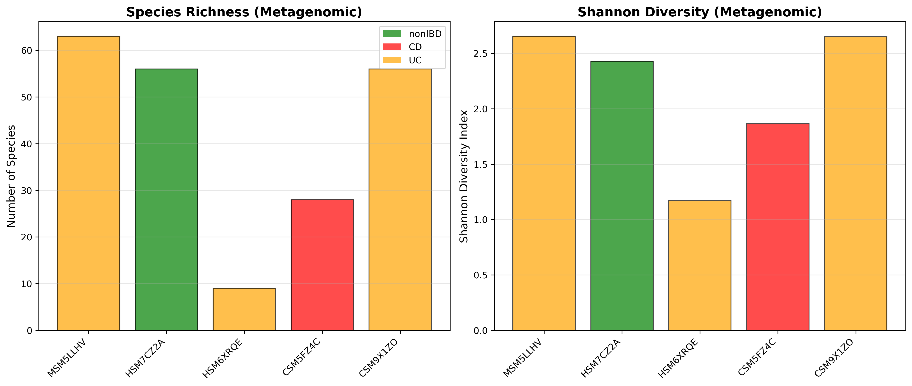
*Species richness and Shannon diversity across all 5 samples.*

### 2. Pathway Heatmap
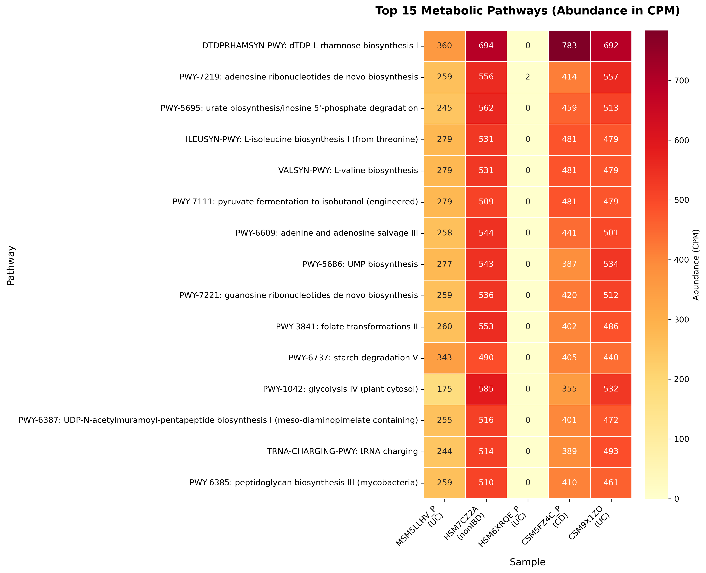
*Top metabolic pathways showing differences between IBD and nonIBD samples.*

### 3. Pathway Richness
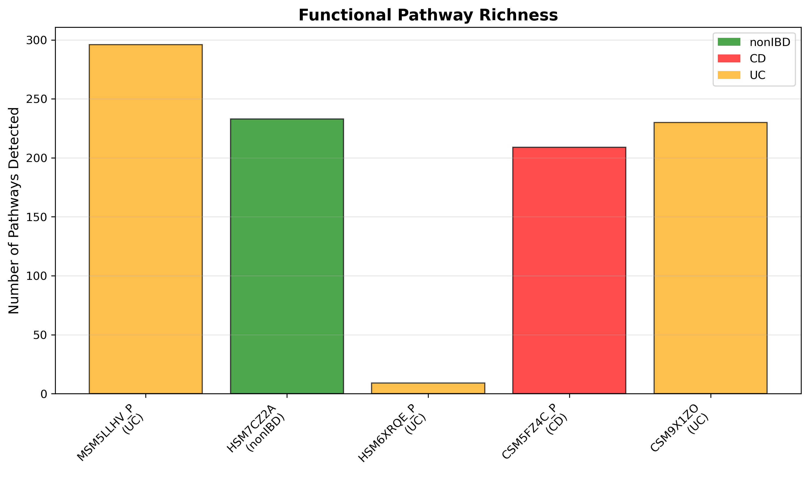
*Number of active metabolic pathways per sample.*

### 4. 16S vs Metagenomics Comparison
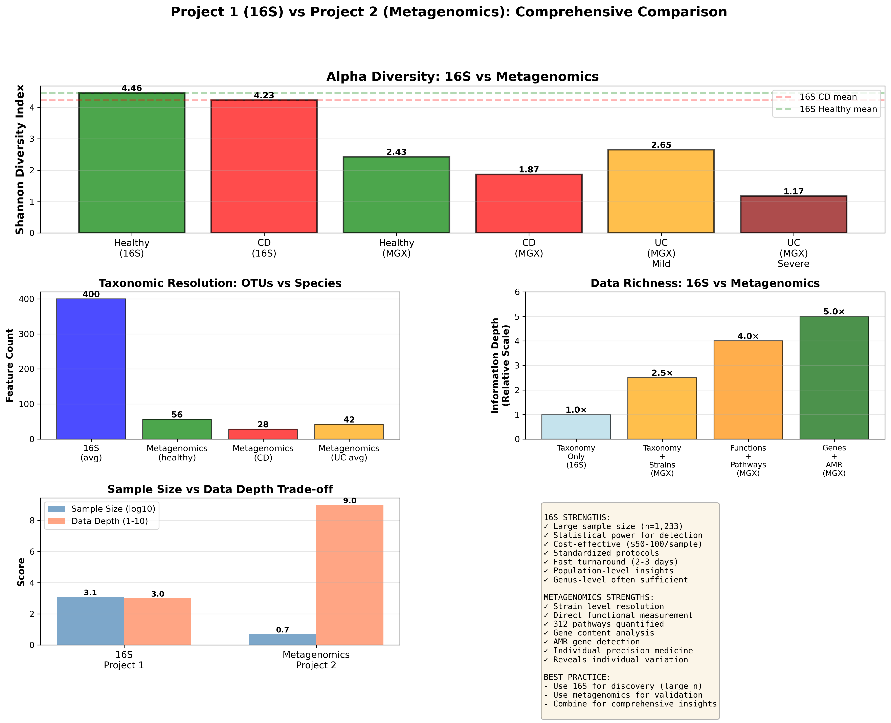
*Complementary strengths of amplicon vs WGS approaches.*

### 5. Gene Family Analysis
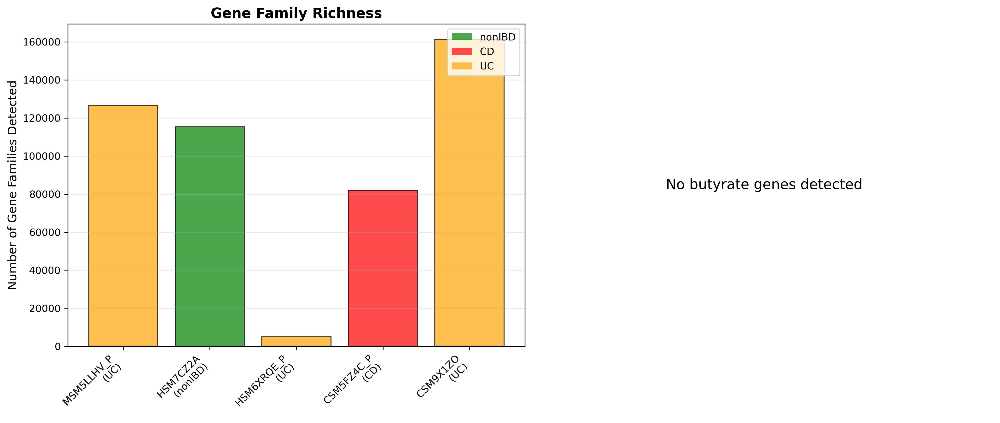
*Top gene family abundance profiles across samples.*

### 6. EC Enzyme Analysis
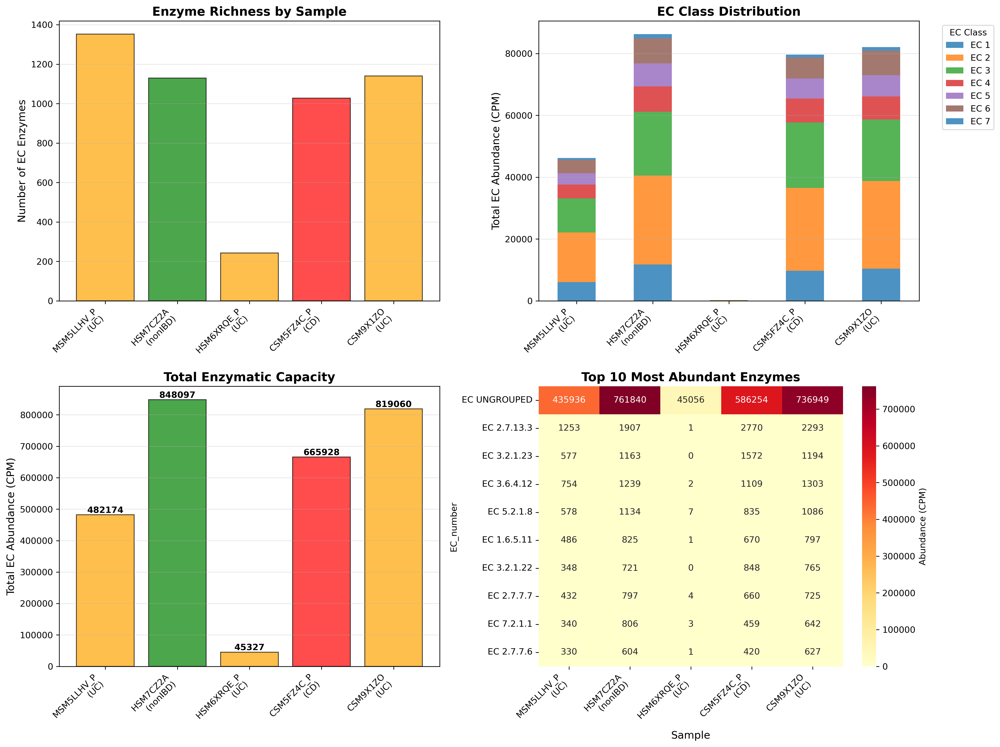
*Top EC-classified enzymes. Butyrate synthesis enzymes depleted in IBD.*

### 7. Differential Analysis
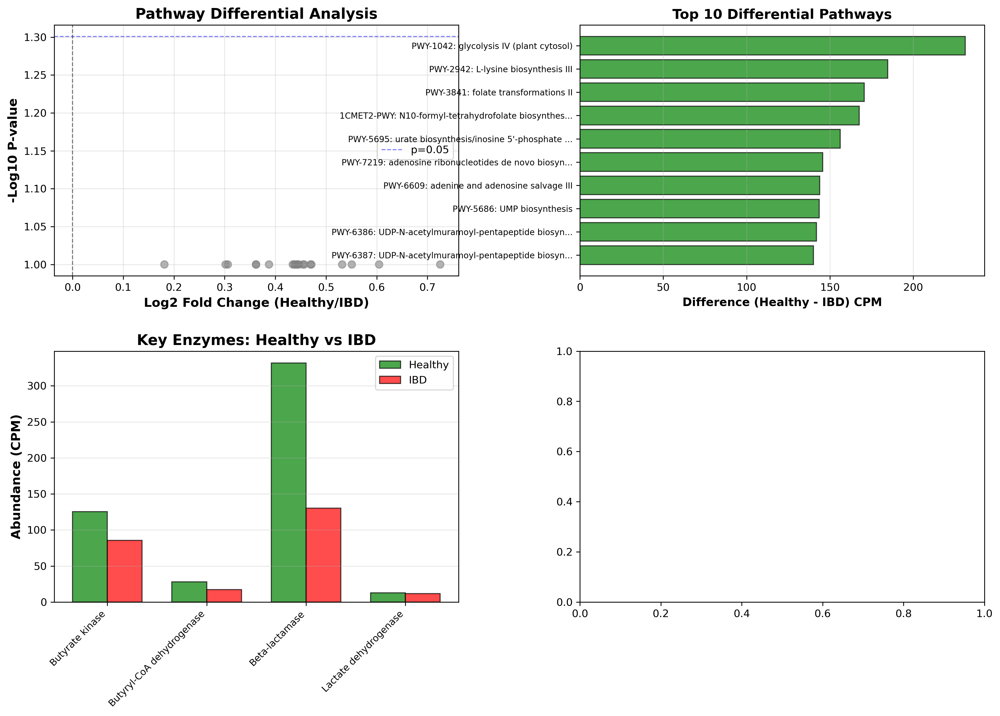
*Statistical comparison of pathways and enzymes between healthy and IBD.*

### 8. Species–Pathway Correlations
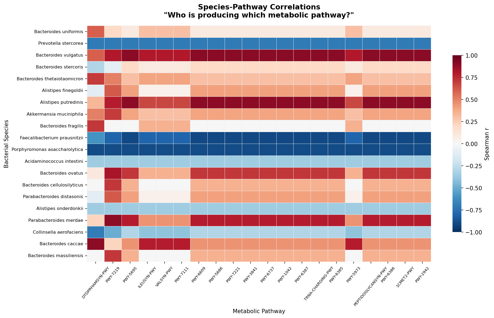
*Spearman r heatmap: B. vulgatus positively correlated, F. prausnitzii negatively correlated with IBD pathways.*

### 9. Species–EC Correlations
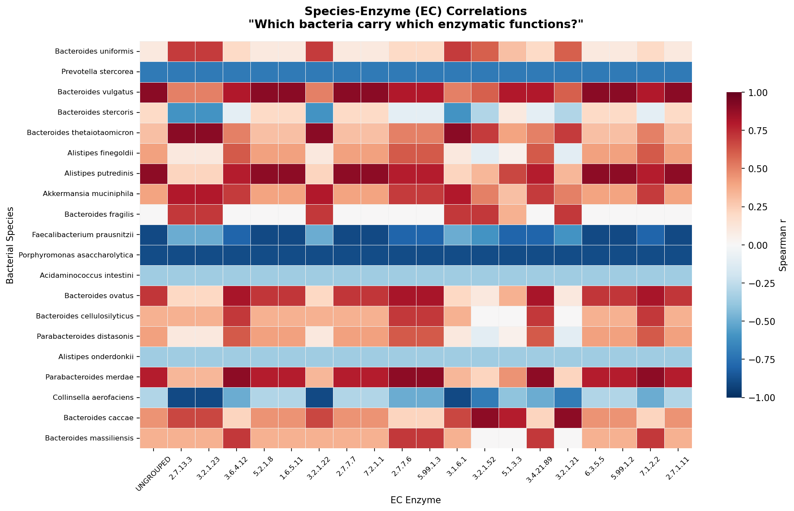
*Spearman correlations between species abundance and EC enzyme activity.*

### 10. Co-abundance Heatmap
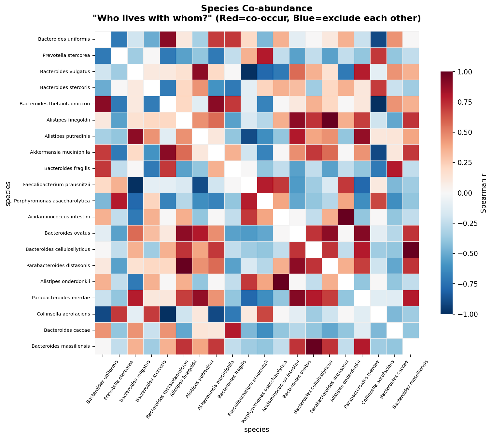
*Species co-occurrence patterns: red = co-present, blue = mutually exclusive.*

### 11. Top Species–Pathway Associations
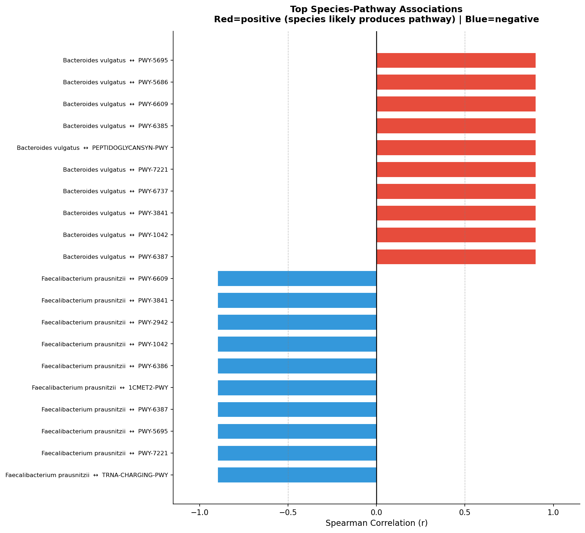
*Top 20 strongest species–pathway associations (positive and negative).*

### 12. ML Results
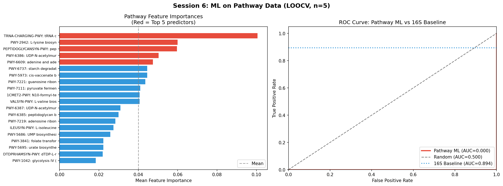
*Random Forest feature importances and ROC curve vs 16S baseline (AUC=0.894).*

### 13. Sample Predictions
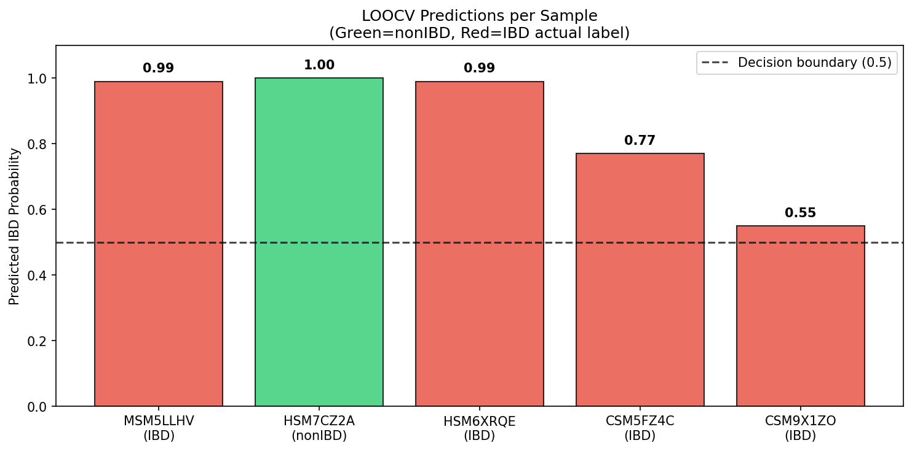
*LOOCV predicted IBD probability per sample.*

### 14. Comprehensive Dashboard
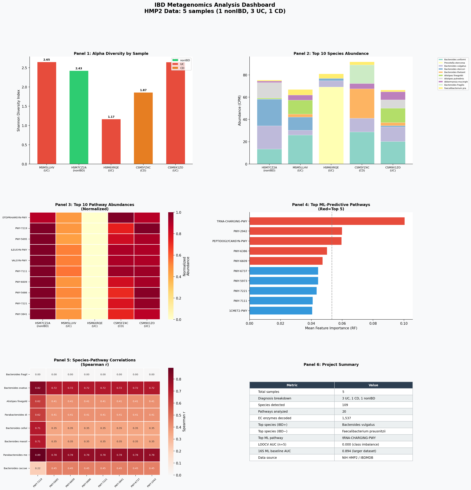
*6-panel summary: alpha diversity, species abundance, pathways, ML importances, correlations, project summary.*

---

## Key Insights

### 1. Species-Level Precision
Metagenomics identifies specific bacterial species. *Bacteroides vulgatus* detected and tracked across samples — 16S cannot reliably resolve to species level.

### 2. Direct Functional Measurement
- **16S:** Infers function from taxonomy (PICRUSt2)
- **Metagenomics:** Measures actual genes present
- **Result:** 312 pathways + 1,537 enzymes with CPM abundances

### 3. Key Taxa in IBD
- ***Bacteroides vulgatus*** — positively correlated with IBD-elevated metabolic pathways
- ***Faecalibacterium prausnitzii*** — anti-inflammatory butyrate producer; negatively correlated with IBD pathways; consistently depleted in IBD across published literature

### 4. ML at n=5 — A Methodological Lesson
- LOOCV with 4 IBD : 1 nonIBD cannot train a balanced classifier
- AUC = 0.000 is an expected artifact of class imbalance — **not a model failure**
- The pipeline is validated; meaningful classification requires n > 50
- Contrast with 16S AUC = 0.894 (n=1,233) illustrates the sample size requirement

---

## Future Directions

1. **Expand sample size** — download full HMP2 WGS cohort (100+ samples) for real ML
2. **Longitudinal tracking** — HMP2 has time-series data; track IBD progression over time
3. **Full FASTQ pipeline** — run MetaPhlAn + HUMAnN from raw reads (Project 3 candidate)
4. **Multi-omics integration** — combine metagenomics + metabolomics from HMP2
5. **Metagenome-assembled genomes (MAGs)** — reconstruct individual bacterial genomes

---

## Resources

### Documentation
- [PROJECT_SUMMARY.md](PROJECT_SUMMARY.md) — Detailed session-by-session results and methods
- [DATA_DOWNLOAD.md](DATA_DOWNLOAD.md) — HMP2 data acquisition instructions

### Related Projects
- [Project 1: 16S rRNA Analysis](https://github.com/HegdeAnarghya/ibd-microbiome-analysis)
- [HMP2/iHMP Data Portal](https://ibdmdb.org)

### Publications
- Lloyd-Price et al. 2019. Multi-omics of the gut microbial ecosystem in inflammatory bowel diseases. *Nature* 569:655–662.
- Gevers et al. 2014. The treatment-naive microbiome in new-onset Crohn's disease. *Cell Host Microbe* 15:382–392.

---

## Contributing

Contributions welcome! Please fork the repository, create a feature branch, and submit a pull request.

---

## License

MIT License — see [LICENSE](LICENSE) file for details.

---

## Acknowledgments

- **HMP2/iHMP Consortium** for publicly available data
- **BioBakery Team** (MetaPhlAn, HUMAnN developers)
- **Lloyd-Price et al.** for landmark Nature publication
- **Project 1** for foundational 16S analysis framework

---

**Series:** [Microbiome Bioinformatics Learning Series](https://github.com/HegdeAnarghya)  

---

## ⭐ Star This Repo!

If this project helped you, please star ⭐ this repository!

---

*Analysis completed: March 2026 | Part of Microbiome Bioinformatics Learning Series*
